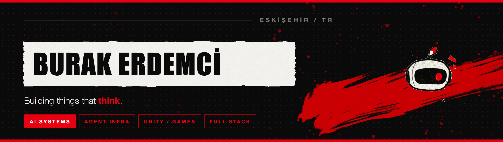
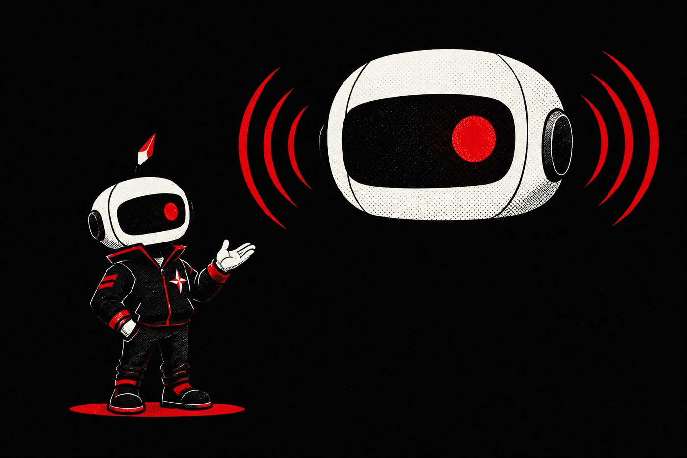
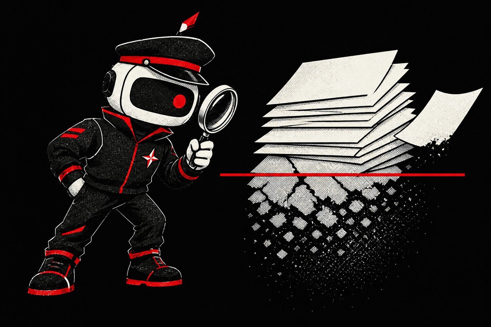
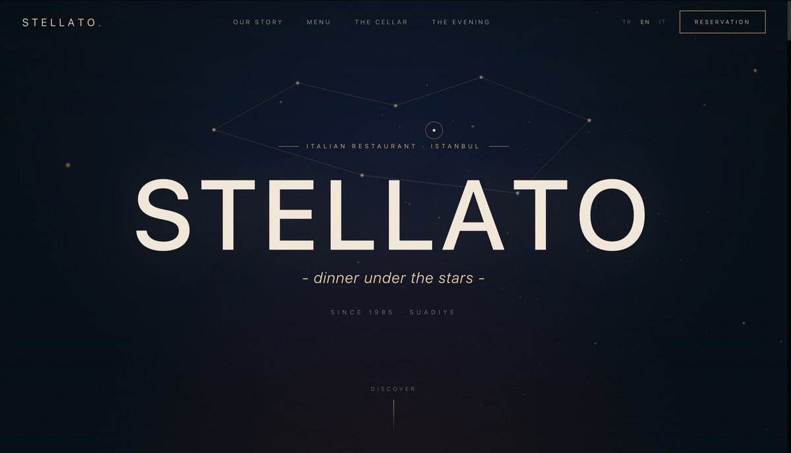
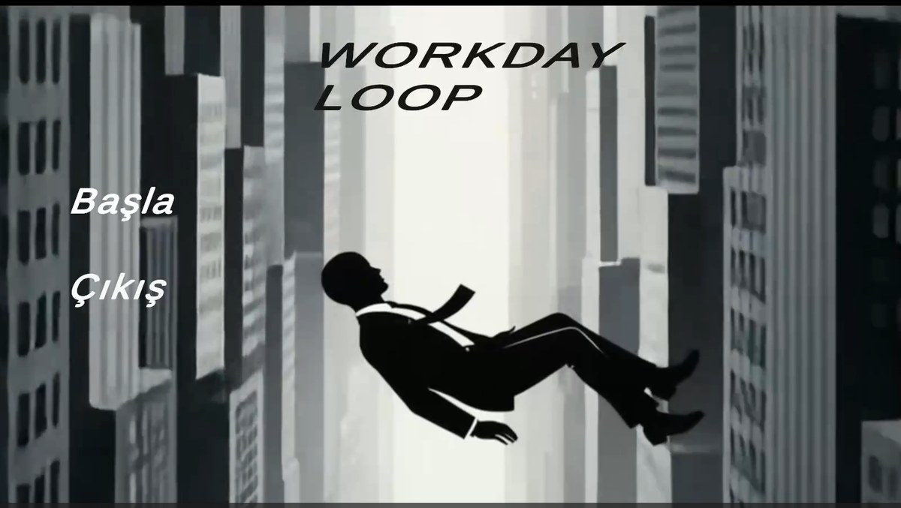

  <a href="https://www.burakerdemci.com"><b>burakerdemci.com</b></a>
  &nbsp;·&nbsp;
  <a href="https://www.linkedin.com/in/burak-erdemci-a3994833b/"><b>LinkedIn</b></a>
  &nbsp;·&nbsp;
  <a href="mailto:erdemciburakemre@gmail.com"><b>erdemciburakemre@gmail.com</b></a>

 

In 2024 I walked away from marine engineering — not because I had a plan, but because
I needed a change. I picked up Unity out of curiosity, and within months I was building
games, then web apps, then AI systems. Eighteen months later I have two agentic AI
projects in active development and haven't looked back.

I use AI tools daily and take verification seriously — tests, reasoning, review. I work
best when I own a problem end-to-end.

 

## Building now

<table>
<tr>
<td width="54%" valign="top">

<h2><a href="https://github.com/BurakErdemci/gamachine">Gamachine</a></h2>

<b>An AI game-dev studio for Unity.</b> 
Every coding agent and live Unity control in one desktop app, behind one approval gate.

<ul>
<li><b>7 CLI agents</b> plus 8+ cloud APIs and local Ollama — switchable per message</li>
<li><b>One approval gate for all of them.</b> Every file write and shell command goes
through the same panel</li>
<li><b>46 Unity Editor tools</b> over MCP — the agent drives the live Editor, and can
play the game it just built</li>
</ul>

<code>Python</code> <code>FastAPI</code> <code>React</code> <code>Electron</code>
<code>MCP</code> <code>C#</code>

<a href="https://github.com/BurakErdemci/gamachine/releases/latest"><b>Download →</b></a>
&nbsp;·&nbsp; Selected for the ETO <i>Kampüsten Ticarete</i> program

</td>
<td width="46%" valign="middle">

</td>
</tr>
</table>

<table>
<tr>
<td width="46%" valign="middle">

</td>
<td width="54%" valign="top">

<h2><a href="https://github.com/BurakErdemci/JARVAN">Jarvan</a></h2>

<b>A voice-and-vision assistant that remembers.</b> 
Sees my screen, hears my voice, answers in <b>~200 ms</b> over the Gemini Live API.

<ul>
<li><b>Two-layer persistent memory</b> — structured JSON profile plus ChromaDB RAG</li>
<li>An <b>InsightAgent</b> pulls durable learnings out of each conversation on its own</li>
<li><b>12 integrated tools</b> — Spotify, Gmail, Playwright MCP, screen vision</li>
</ul>

<code>Python</code> <code>Gemini Live</code> <code>ChromaDB</code> <code>Electron</code>
<code>MCP</code>

</td>
</tr>
</table>

<table>
<tr>
<td width="54%" valign="top">

<h2><a href="https://github.com/BurakErdemci/Context-Police">Context Police</a></h2>

<b>A background auditor for AI agent memory.</b> 
Agent memory is written once and trusted forever. This watches sessions, extracts
durable findings, and flags the notes that have quietly gone stale.

<ul>
<li>On a real 329-commit project, <b>61% of existing memory notes had rotted</b> —
that measurement is what started the project</li>
<li><b>Nothing is ever deleted.</b> Decay is reported, never silently corrected</li>
</ul>

<code>TypeScript</code> <code>Node</code>

</td>
<td width="46%" valign="middle">

</td>
</tr>
</table>

 

## Shipped

<table>
<tr>
<td width="50%" valign="top">

  

<h3><a href="https://github.com/BurakErdemci/ristorante-stellato">Ristorante Stellato</a></h3>

A restaurant reservation system, designed and shipped end to end — not a tutorial
build.

<ul>
<li>REST API, NextAuth v5, MongoDB, and an admin dashboard with filtering and pagination</li>
<li><b>53 Vitest unit and integration tests</b>, PWA offline support, TR/EN i18n,
IP-based rate limiting</li>
</ul>

<code>Next.js 16</code> <code>TypeScript</code> <code>MongoDB</code>
<code>NextAuth v5</code> <code>Vitest</code>

<a href="https://ristorante-stellato-puum.vercel.app"><b>Live demo →</b></a>

</td>
<td width="50%" valign="top">

  

<h3><a href="https://github.com/BurakErdemci/Workday-Loop">Workday Loop</a></h3>

A 2D psychological thriller about the monotony of modern work. Built with a team
of three and published on itch.io.

<ul>
<li>Multiple endings driven by what the player chooses, not how well they play</li>
<li>Atmosphere owed to Nier: Automata and The Stanley Parable</li>
</ul>

<code>Unity 6</code> <code>C#</code> <code>URP 2D</code>

<a href="https://burakerdemci.itch.io/workdayloop"><b>Play it →</b></a>

</td>
</tr>
</table>

 

## Stack

 

Eskişehir, Turkey &nbsp;·&nbsp; open to remote work

